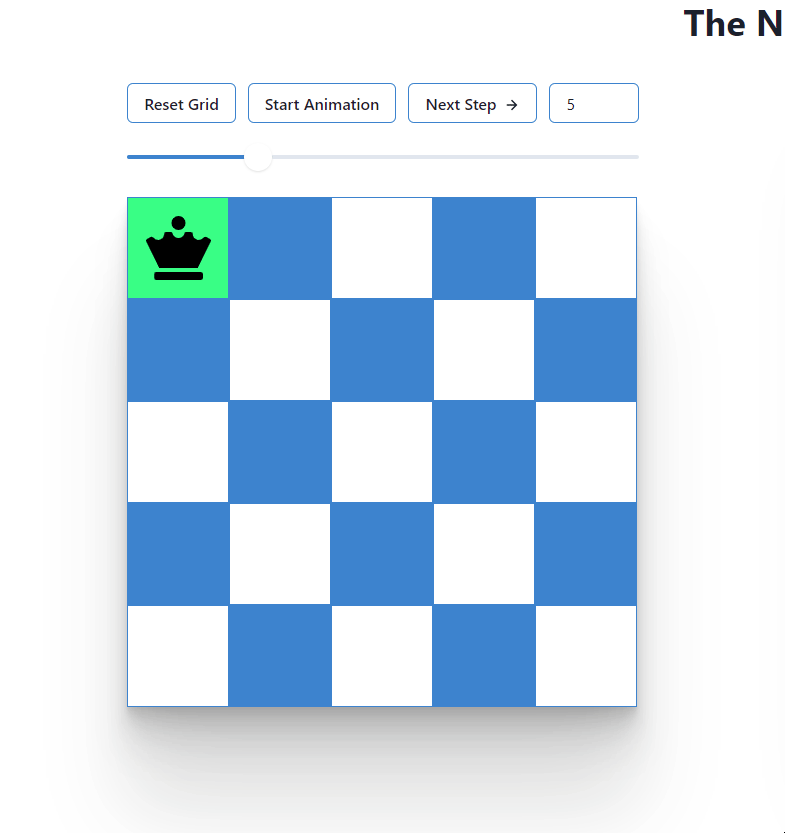

<h1>N-Queens problem visualization and explanation </h1>

Problem:
  Place N-queens on an N×N chess board such that no queens attack each other. 

Built with:
<ul>
  <li>React, Hooks</li>
  <li>Chakra UI  library</li>
</ul>
<h3>
  <a href="https://n-queens-visualization.netlify.app/">
    Website
  </a>
</h3>

